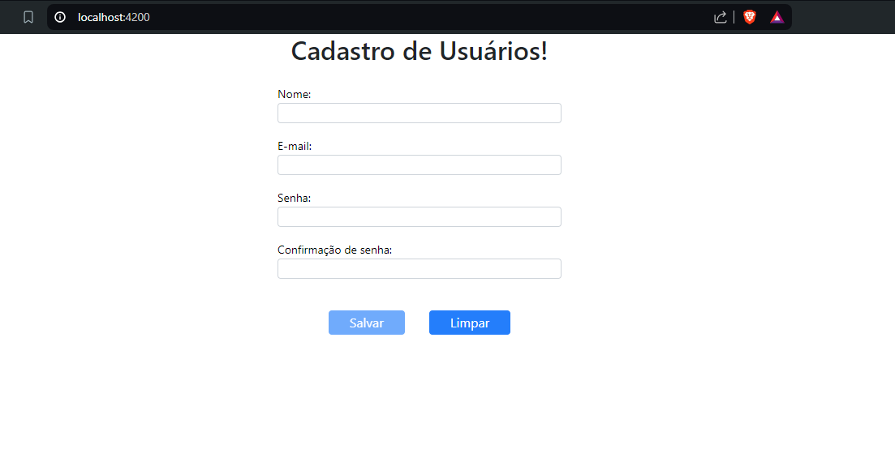

# Frontend Angular 

This project was generated with version 17.0.0.

## Use components

This project use Angular UI components [PrimeNG](https://primeng.org/)

## Development server

Run `ng serve` for a dev server. Navigate to `http://localhost:4200/`.

## Running unit tests

Run `ng test` to execute the unit tests via [Karma](https://karma-runner.github.io).

## Running prod version

Run `docker-compose up --build` using docker

### Screen CRUD
